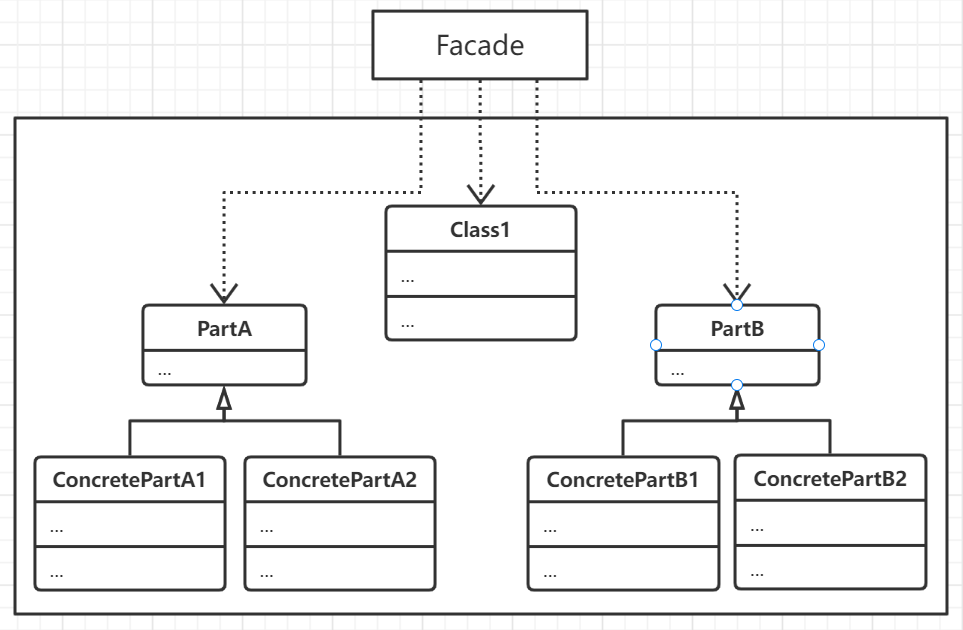

# 外观模式

为子系统中的一组接口提供一个一致的界面，从更高层来概括这个子系统所提供的功能，使得这个子系统更加方便使用，同时也使得
各个子系统之间降低耦合程度，但依然提供了访问子系统内部某些接口或实现的机会。

一般情况下外观模式可以和抽象工厂模式一同使用，即以子系统的粒度生产对象。实际上抽象工厂也可以代替外观模式来隐藏那些与
平台相关的类。

实际上外观模式也是在搭建由多个功能解耦的子系统所构成的复杂系统时最基础也是最常用的设计模式。

## 思想

考虑到一个相对较大的系统往往会划分为多个子系统，子系统之间能够通过一组预定义的接口进行访问和交互，对于用户而言一个
简单统一界面能够降低子系统调用时的复杂程度，从而整个系统的复杂度也会降低。同时，各个子系统也会和客户之间因为这一层
抽象而变得松耦合，子系统内部无论怎么耦合则不会影响到用户。

## 要素

1. 一个抽象代表了整个子系统的外观类Facade, 即子系统的调用入口，内部保留了子系统中实现对象的引用，当有用户请求时
直到将该请求交给适当的子系统对象处理。
2. 子系统部分，实现子系统的各个功能，处理由Facade指派的任务但不保留Facade指针，并且并不要求完全对外隐藏，可以暴露一部分公共接口供
外部客户调用。
3. 需要注意在一个子系统中需要考虑公共子系统类和私有子系统类。子系统和类一样都封装了细节部分，需要对客户暴露的可以考虑
为公有接口设计，而需要子系统内部扩展的则需要考虑私有接口设计，这个一般需要使用命名空间来隔离。

## 场景

- 需要为一个实现复杂的子系统提供简单的对外客户调用接口，使得一般的客户通过此接口就可以完成绝大多数任务而不需要直到内部实现。
- 需要将客户子系统与功能子系统相互分离。
- 需要构建一个层次结构的子系统时，使用外观模式中定义的每层的入口点，如果子系统之间和相互依赖，则通过各个子系统的Facade进行通信，
简化它们之间的依赖关系。

