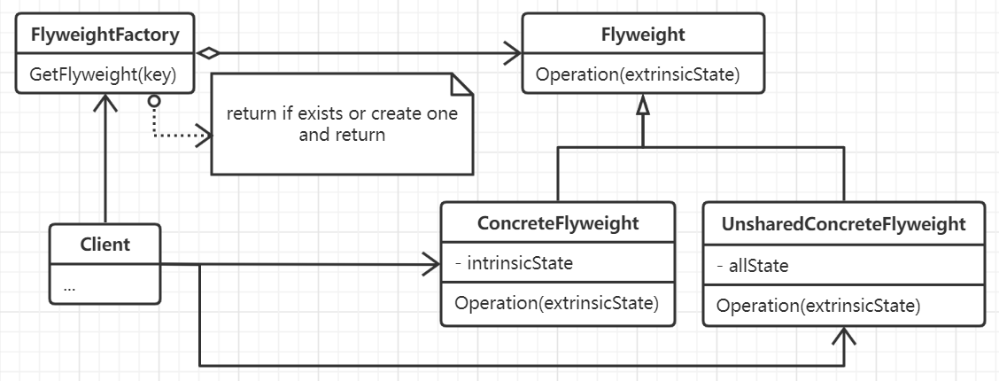

# 享元模式

通过共享机制来有效地支持大量细粒度的对象，可以同时在多个场景中使用，并且在每一个对象中都可以作为一个独立的对象。

## 思想

核心是将一个对象划分为内部状态还是外部状态。在内部状态中，它包含了独立于所有场景的信息和数据，也因此使得它可以共享。
而外部状态是则具体取决于场景信息，并根据场景而变化，因此不可共享。用户对象负责在必要的时候将外部状态传递给享元对象。

享元模式主要是对那些数量太多比较难以用对象来表示的概念或者实体建模，虽然在传输、查找和计算外部状态都会产生开销，但是
因此内部状态共享， 当数量庞大的情况下空间上的节省将是十分可观的。从而弥补运行时的耗费。实际上，在享元模式中，一个最
值得关注的思想就是使用内部共享来节省内部存储，而使用运行时计算来节省外部状态存储。

## 要素

1. 首先需要描述一个享元接口，对象通过这个接口接收信息并作用于外部状态。
2. 实现各个独立于场景的具体享元类，并为内部状态增加存储空间。
3. 对于那些不需要共享的享元类实际上也可以存在。
4. 享元对象的创建工厂，创建并管理享元对象。
5. 客户端维持对享元对象的引用。
6. 享元对象执行时的状态必定来自于可共享的内部状态和各自的外部状态，外部状态和数据往往由客户进行计算和存储，当调用
该享元对象时，则把这些状态传递给他。

## 场景

- 一个应用程序会使用大量类似的对象。例如游戏中的对象以及文档编辑器中的字符对象。
- 大量的对象会造成巨大的存储开销。
- 对象的大多数状态可以变为外部状态，而外部状态之间是不共享的，如果删除或者新增操作仅仅是影响对象的外部状态，那么就可以使用较少的共享
对象来代替很多对象。
- 应用程序不依赖对象标识。
