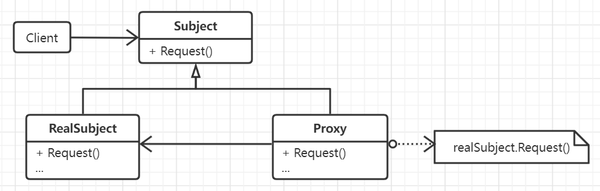

# 代理模式

提供了对真实访问对象的一种控制机制，只有在特定的时机才会真正地调用这个对象并提供合适的方法，而通过实现统一接口的
形式完成在一般调用流程中的行为表示与在合适时机真实对象的行为表示的封装，以达到客户代码调用时的透明。

代理模式经常在创建开销比较大的对象时使用。例如在文档编辑器中，对图像进行代理，只有当真正需要绘制图像时才会调用
真实图像的绘制方法，否则便不会创建这个对象以节省资源，而是返回开销较小的表示对象，当对象被真正创建之后便会一直保持
对其的引用，然后在合适的时机想真实对象转发请求。

和适配器模式相比，代理模式提供的是相同的接口，而适配器则是适配不同的接口。另外，用于访问保护目的的代理则有可能会拒绝
真实实体的某些操作的执行。

和装饰模式相比，虽然二者的实现非常相似但二者的目的完全不同，装饰模式会为真实对象附加额外的功能但代理模式则是提供对象的
访问控制。而且代理模式有可能不包含对实体的直接引用，而是一个包含了必要信息的间接引用或虚拟引用，在需要时才会获得真实引用。

## 思想

在很多系统内都会有对某些对象根据不同的时机作出不同行为，但是调用接口统一的需求，或许是为了完成对资源使用的优化和节省，
或许是为了隐藏真实对象，总体上都可以通过创建这个真实对象的代理来实现上述功能。代理对象和真实对象拥有相同的调用方法，但是
代理对象只是为完成整个调用流程而提供了浅层的形式化行为，真实功能则依然由内部的真实对象提供。

## 要素

1. 代理。保存一个引用(可以是真实引用也可以是虚拟引用)使得代理可以访问实体。实际上如果真实对象和代理对象的接口相同，
那么代理对象便可以完成对整个接口的引用。
2. 接口。真实对象和代理所实现的真实接口，任何使用真实对象的地方都可以使用代理。
3. 真实对象。
4. 访问对象时引入了一定程度的间接性。比如隐藏不同地址空间，对引用进行最优化，在对象引用时附加额外处理。利用代理模式还可以
实现写时复制Copy-On-Write这一机制，即拷贝一个庞大而复杂对象是一种开销比较大的操作，如果这个拷贝没有被修改，那就没有拷贝
的必要，使用代理机制来延迟拷贝，而代理通过增加引用计数的方式来完成对实体创建和销毁的控制。

## 场景

- 在需要使用比较通用和复杂的对象指针的时候需要使用代理模式，比如:
  * 远程代理: 为一个对象在不同的地址空间提供局部代表。
  * 虚代理: 根据需要创建开销很大的对象，比如文档编辑器中的图像。
  * 保护代理: 控制对原始对象的访问，比如在不同权限下对对象的访问。
  * 智能指引: 在访问对象时提供一些额外操作。
- 对指向实际对象进行引用计数，当真实对象没有引用时则可以释放它。比如智能指针。
- 资源对象的懒加载。
- 安全访问与锁定机制。
