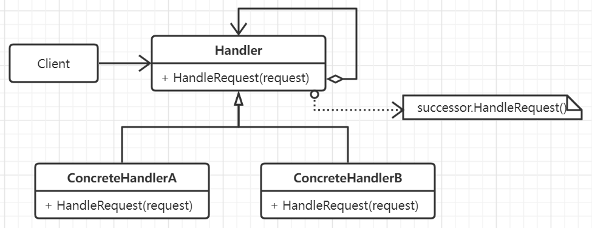

# 责任链模式

有多个对象可以处理同一种请求，为了使得每个对象都有处理请求的机会，且避免请求和处理者之间的耦合关系，可以将这些处理对象
形成一条链，并沿着这一条链来传递请求，直到有一个对象接受处理它为止。

责任链模式实际上往往通过组合模式来实现，而且链直接往往会形成U形调用，例如Gin中的中间件处理就是一种典型的责任链模式。

## 思想

责任链模式的核心在于认为给多个对象一个处理请求的机会，从而解耦发送者和接收者，该请求沿着传播链一直往后传播直到有一个对象
进行处理。传播链上的请求处理接受者首先需要是隐式的，并且都有着一致的处理请求以及访问链上后继者的接口。一般情况下，类似异常
处理机制，链上的请求处理对象随着请求的越深入也会由具体而变为越具一般性。

首先，责任链模式会极大程度降低请求和请求处理者之间的耦合程度，请求只知道可能会存在某个处理对象来正确处理但不知道是确切的哪一个。
而且请求并不被保证一定能够被接受。处理者和请求者都不需要直到对方的结构和明确的信息。链上的对象只需要互相连接，保持指向后继对象的引用即可。责任链也动态添加
或删除处理对象的灵活性。

## 要素

1. 定义请求处理者Handler的接口。
2. 在每个请求对象中可以选择实现后继链。每一个具体的处理者处理所负责的请求，并且能够访问它的后继者，如果
能够请求则执行请求否则则将转发给它的后继处理对象。
3. 客户代码向向链上的具体请求者提交请求。
4. 请求需要被合理的表示。方法硬编码的形式简单并且安全，但只能转发与方法含义固定的一类请求。如果采用传递请求
类型参数的方法则需要双方约定好编码，并且需要条件语句来分派，裸露的数据需要手工进行封装和拆机，相对不是很安全。
一般常采用独立的请求对象来封装请求参数，请求类可以明确地明确它的请求，并且还可以通过继承机制完成更多的子类请求。
请求处理对象只处理指定类型的请求对象。请求对象本身提供了处理对象访问请求类型的方法，并且还可以通过运行时获取
具体的请求子类，即强制类型转换或者类型断言。

## 场景

- 有多个对象可以处理同一个请求，那个对象处理该请求运行时自动确定。
- 在不想明确接收者的情况下，向多个对象中的一个提交一个请求。
- 处理一个请求的对象集合被动态绑定。
