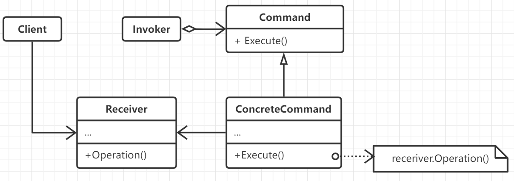

# 命令模式

将一般的请求参数封装为一个对象，从而使得可以用不同的请求对客户进行参数化，对请求排队或者记录请求日志。以及支持可以撤销的
操作。命令模式是对整个请求处理过程的抽象，而不是字面意义上的参数封装。

和命令模式相关的有组合模式与备忘录模式。

## 思想

在某些应用场景中，需要向某对象提交请求，但并不知道关于被请求的操作或请求的接收者的任何信息，尤其是在组件式开发过程中，
真正的请求接收者或者处理对象动态绑定，设计者并不知道它们的实现细节。

命令模式将请求-处理这一过程抽象化，将请求本身变为一个对象使其可以向未指定的应用发生请求，并且可以被存储和传播。通过为请求
定义接口，并暴露执行方法，每一个具体请求子类中在创建时都含有执行该请求的接收者实例，在自身的执行方法内调用接受者
的方法来完成请求处理。典型代表便是图形界面中的菜单，图形界面开发工具箱并不知道请求用户交互请求的真实处理对象，但在自身实现
时必然会向某个对象发送该请求，通过在初始化时确定命令对象便可完成请求处理的绑定。

命令模式首先将调用者和实现者解耦，并且很方便进行扩展。命令对象也可以调整自己的粒度，可以自己完全实现请求的处理，或者
需要借助其它接收者。命令对象也可以自己拥有状态，利用状态完成对请求的取消和重做等复杂功能，例如需要提供一个历史列表和逆向执行的方法。
撤销和重做机制本身比较复杂考虑的情况很多，命令模式是处理这种复杂性的有效模式。

在Go或Python这种函数对象为一等公民，并且支持闭包的语言环境下命令模式便可以很方便实现。

## 要素

1. 生命执行操作的命令接口。
2. 将一个具体的接收者绑定到某一个命令实例中，在该实例的执行方法内调用接收者的处理方法。
3. 调用客户端，创建一个具体命令并设定它的接收者。
4. 调用方，要求该命令执行这个请求，一般为框架，例如回调。
5. 接收者，直到如何执行一个请求相关的操作，即那些请求真正的执行者。接收者同样可以进行抽象。

## 场景

- 命令模式是回调机制的一个面向对象的替代品，在需要实现回调机制的面向对象版本时便可以采用命令模式来完成这种参数化机制。
- 需要在不同的时刻指定、排列和执行请求。
- 支持提交、取消等复杂的处理，通过命令对象内部的状态来完成和时刻相关的功能，例如实现执行和撤销接口来完成对命令执行的
控制。例如支持修改日志等操作。
- 需要提供对事务进行建模。利用构建在原语上的高层操作来完成一个功能系统，例如封装了对数据一组变动的事务。
