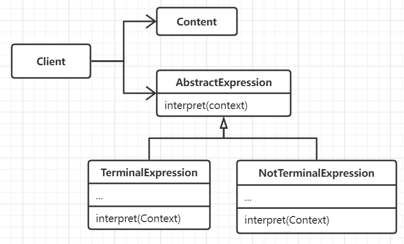

# 解释器模式

给定一个语言，并定义它文法的一种表示和对应的解释器，这个解释器使用该表示来解释语言中的句子，例如对某表达式求值或者
模式匹配等。实际上解释器模式往往有特定的场景，那就是问题可以被抽象为语言的解释，例如在编译器中会经常用到。对于
简单的文法规则而言解释器模式是适用的，但是更复杂的情况则需要使用FSM或者语法分析程序执行。

## 思想

为简单的语言解释类问题提供解决方案，以各个文法规则子类来解释一个句子。

## 要素

1. 抽象表达式，声明一个抽象的解释操作，这个接口为抽象语法树中的所有结点共享。
2. 终结符表达式，实现与文法中的终结符相关联的解释操作。
3. 非终结符表达式，对应每一条文法规则。
4. 包含解释器之外的全局信息。
5. 需要创建抽象语法树，解释器模式并不涉及到语法分析，抽象语法树可以用表驱动也可以递归下降语法分析程序构建。
6. 需要定义解释操作。

## 场景

- 有一种语言需要解释执行，并且需要将该语言中的每一个句子表示为一个抽象语法树。在文法相对简单，不会产生庞大的类层次，并且
对效率不是有很高要求的情况下非常适用。
