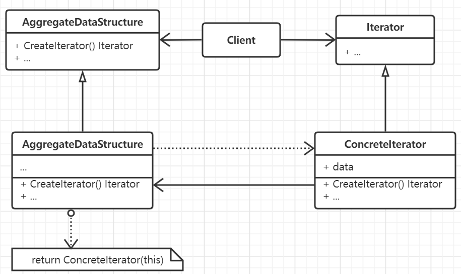

# 迭代器模式

提供一种方法顺序访问某一个聚合对象内部提供的各个元素，而又不需要暴露聚合对象内部的数据实现。一个聚合对象，可能需要针对
不同的需求对完提供数据访问服务，但是又不能暴露自身的内部实现，也不能因为多样的遍历方式而同时存在多种实现，将数据和访问
紧紧耦合。

迭代器经常被用到组合模式这样的复合结构上，用于在整个树形结构上完成遍历，而且经常依赖于工厂方法实例化适当的子类。迭代器还可以和备忘模式搭配，
用一个备忘模式捕获一个迭代的状态，并在其内部存储。

## 思想

迭代器模式的核心思想是将聚合对象的数据组织与访问相分离，迭代器定义了访问的方法和对数据的跟踪，聚合对象仅选择哪一种
迭代器对外提供访问即可。

通过迭代器模式可以完成在同一个聚合对象上完成多种遍历，并借助迭代器完成聚合对象的接口简化。

## 要素

- 迭代器的抽象接口，定义遍历一个对象所需要的基本操作。
- 各个具体的迭代器实现。
- 聚合对象的抽象接口。
- 具体的聚合对象定义。
- 迭代器的控制者。需要考虑一个迭代器对象的迭代过程应该由谁来控制，如果是外部的客户那么这就是一个外部迭代器，由聚合
对象来控制迭代器则是内部迭代器。外部迭代器必须主动推进迭代过程，显式地向迭代器请求下一个元素。而内部迭代器只需要提交
一个动作，内部迭代器将会对每一个元素执行这个动作。一般上外部迭代器会更灵活。
- 迭代算法的实现。 聚合和迭代器对象都可以实现迭代算法，**但聚合对象实现时就需要迭代器额外地保留相关状态，比如位置，此时便是游标。
利用游标参数调用聚合对象提供的Next方法获取下一个对象，此时数据会被隐藏**。如果使用迭代器实现则会带来更多的扩展性和可重用性，但
由于要访问到聚合对象的内部数据，会破环封装性。
- 需要保证迭代的安全性，即在遍历的过程中不应该改变这个迭代器对象。
- 需要时刻维护内存，避免造成内存泄露。但可以通过栈上分配的代理对象来对此进行补救。
- 对于某些特殊操作可以为迭代器提供特权，使其能够直接访问聚合对象中的数据。
- 对于那些复合对象的迭代内部实现会好一些，因为整个遍历路径可以通过递归调用而隐藏在调用栈中。但如果这个复合对象中的结点能够
提供更多的自身周围的信息，那么使用外部迭代器会更好一些。
- 空迭代器有利于处理边界条件。在遍历的每一个结点，都可以向当前结点请求访问器内部迭代器，此时聚合元素将返回一个具体的迭代器，但
叶子结点会返回一个空迭代器，此时便可以以统一的方式在整个复杂结构上遍历。

## 场景

- 访问一个聚合对象的内容而无需暴露它的内部表示。
- 支持对聚合对象内部数据的多种访问。
- 为遍历不同的聚合对象提供一种统一的访问接口，多态迭代。

