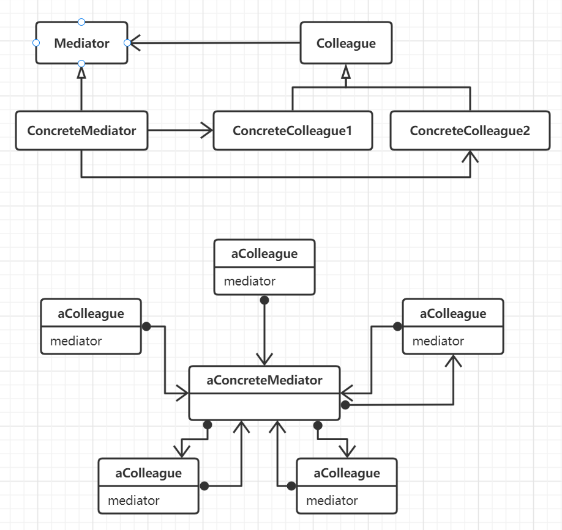

# 中介者模式

用一个中介对象来封装一系列的对象交互，中介者使各个对象不需要显式地相互引用，从而使其耦合松散，而且可以独立地改变它们之间的
交互，避免各个对象都需要知道大量其它对象的信息，以及定义过多的子类完成对应的行为。

中介者模式和外观模式最大的不同之处在于，外观模式是对这个子系统的功能进行抽象，但他的协议是单向的，外观对象只可以对这个子系统提出请求，
但中介者模式则提供了双向通信。

## 思想

面向对象用类和对象来对数据和行为建模，模拟真实世界中的各类事物。对于系统而言，整个系统的功能可能会分布到各个对象中去，这种分布会
导致对象之间的连接过多，耦合程度增加，可复用性降低，但如果存在一个对象专门用来协调各个对象之间的调用和交互，相关的对象仅仅知道中介者，
那么对象之间的连接就会降低很多，中介就充当了信息的流转中心，所有的对象通过中介间接通信，通过不同的中介来组织和复用对象来扩充整个
系统的功能，并且降低内部的耦合程度。

首先，中介者能够有限减少子类生成，中介者将原本分布于多个对象之间的行为集中在一起，改变行为只需要扩展为中介者的子类即可。
将各个对象解耦，可以独立地改变和复用各个功能子类和中介者类。并且利用中介者还能降低对象直接协议的复杂程度。同时也使的控制更加集
中(总线式结构)，对对象协作更加抽象。

## 要素

1. 用于各个对象之间间接通信的中介者接口定义。
2. 具体的中介者，通过协调各个对象以实现协调工作，了解并维护这些对象。
3. 具体的对象类。每一个相关的对象都知道自己所属的中介者，并且当它想与其它对象通信的时候，需要借助这个中介者完成。
4. 中介者在各个对象间转发请求以实现协作行为。
5. 当整个系统中所需要的中介者比较少时，没有必要进行抽象定义。
6. 当对象内部有事件发生或状态改变时，必须要和中介者通信，要么将中介者用观察者模式实现，当所有的对象状态发生改变时发送通知给中介者，
要么直接在中介者内部定义一个特殊的通知接口，各个对象直接调用即可，这种方式最简单。

## 场景

- 一组对象以定义复杂的方式进行通信，各自之间很可能直接保留着对方的引用，产生的相互依赖的关系结构混乱且难以理解。
- 一个对象引用其它很多对象并且直接与它们通信。
- 想定制一个分布在多个类中的行为，而又不想生成太多的子类。

