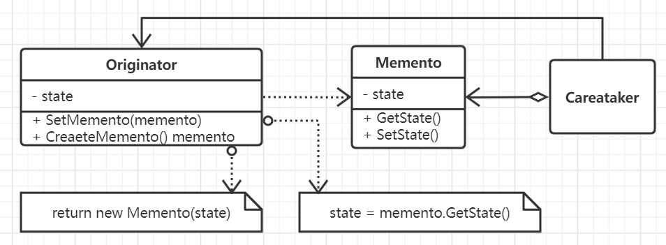

# 备忘录模式

很多场景下需要知道捕获对象的一个状态并保留起来，比如可以支持撤销动作，通过外部保留的状态对象就可以恢复至动作发生之前的检查点。
对象会将所有关键状态隐藏，如果直接将对象内部的的状态在外部进行访问就会破坏封装性，因此可以通过备忘模式来保存对象内部的状态信息。

**备忘录经常和命令模式一同工作，可使用备忘录来为可撤销的操作维护状态**。
而且使用备忘录用于迭代也具有一定的优势。

## 思想

一个备忘录实际上一个对象，它存储的是另外一个对象在某个瞬间的内部状态，这个被保存状态的对象是备忘录对象的原发器，当需要设置原发器的
检查点时，对应的机制例如取消机制会向原发器请求一个备忘录，原发器用描述当前状态的信息初始化该备忘录对象，只有原发器可以从备忘录中存取
数据， 而对其它对象则是不可见的。

备忘录能够很好保持封装边界，可以避免一些只应由原发器管理但是又必须存储在原发器之外的信息，该模式可以把很复杂的原发器内部信息对其它对象
屏蔽起来。从而保持了封装边界。然而备忘录是有代价的，如果客户频繁地创建或者恢复原发器状态，可能会导致非常大的开销。另外对于宽窄接口也需要有
比较好的机制来保证，实际上大多数语言并不能保证这一点。

## 要素

1. 备忘录。存储原发器对象的内部状态，存取的内容是由原发器决定的。原发器以外的对象不应该访问这个备忘录，即管理者或客户只能看到这个备忘录的
窄接口，它只可以将其传递给其它对象，但是原发器可以看到的是宽接口，它可以从中获取到所有的数据。
2. 原发器，需要对内部数据生成检查点的对象。
3. 客户或者管理者，需要保存所有的备忘录对象，但并没有权限对保存的内容进行存取。
4. 考虑如何在备忘录中实现宽窄接口。

## 场景

- 必须保存一个对象在某个时刻的内部数据或状态，以便于在后续时刻能够恢复到先前的状态。
- 如果用接口来使得其它对象直接获取这些状态则会暴露对象的实现细节，破坏封装性。
