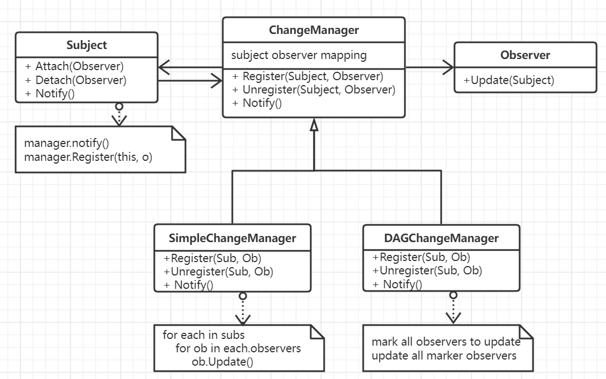

# 观察者模式

面向对象编程将系统的功能分散到各个对象当中，大多数情况下都不可避免地要定义对象与对象之间依赖关系，所有依赖于他的对象对会得到通知并更新。
一个系统被分割成一系列相互协作的类就需要维护它们之间的一致性，但这种一致性又会造成耦合，降低各个类的可重用性。 观察者模式则是为这种不
可避免的依赖提供了一种较为规范的通信方式。

观察者模式用会用到中介模式，比如在更新管理器的实现上。

## 思想

观察者模式根据依赖方向将系统中的对象分为目标和依赖它的观察者，一个目标可以有若干个观察者，当这个目标发生改变时，将会通知它所有的观察者，作为
对这个通知的响应，每个观察者都将查询目标以使其与目标的状态同步。这种交互实际上也是订阅交互模式。

观察者模式可以允许单独地改变目标和观察者，并且可以具有很强的扩展性。观察者可以将紧密的耦合关系变为抽象的耦合，一个目标仅仅知道它有一系列的观察者，
但是具体是那些并不重要。观察者模式支持广播通信，即一次性通知若干个观察者对象，但如果某个观察者进行了意外的更新，或者影响到目标的状态，这种错误比较
难以捕捉。

## 要素

1. 目标，目标可以知道他的观察者，可以有任意多个观察者观察他的目标。并且提供了注册和注销的接口。
2. 观察者。为那些在目标发生改变时需要通知的对象定义一个更新接口。
3. 具体目标，将有关状态存入各个具体对象中，当自身的状态发生改变时，向它的观察者发出**通知**。
4. 具体观察者，维护着具体目标的指针，存储有关状态，实现观察者的更新接口，使得这些状态应与目标的状态保持一致，当收到通知时考虑**查询状态**并更新。
5. 创建目标到观察者之间的映射。以时间换空间的形式来存储观察者到目标之间的关联。
6. 当某一个观察者需要同时观测多个目标时需要对更新接口进行扩展，以确保能够明确得知来自哪一个数据源。
7. 更新的触发。有目标对象进行通知更新，实现最为简单，封装性更好但是效率较低。也可以由客户在适当的时机尽心通知。
8. 目标需要在通知完成前后确保自身状态是一致的。目标利用**推拉模式**来完成信息的通信，如果不管观察者需要与否，将所有信息全部发送，而拉模式则是
仅仅最小通知，然后由观察者来决定是否进一步获取数据。推模式需要知道观察者的身份以给定合适的数据，拉模式效率较差，并且数据也又可以不一致。
9. **显式指定感兴趣改变的接口**。可以扩展目标的注册接口，使得各个观察者只对自己感兴趣的内容进行观测。
10. 使用更改管理器来维护目标之间的复杂关系，尽可能减少观察者反应其目标的状态变化所需要的工作量。它会定义一个特定的更新策略，根据目标的请求来更新
这个目标的观察者。实际上更改管理器是中介者的实例。

## 场景

- 当一个系统或者抽象模型有两个方面，其中一个方面依赖于另外一个方面，将这二者封装在独立的对象中使得它们可以独立地改变和复用。
- 当对一个对象的改变需要同时改变若干个潜在的对象。
- 当一个对象必须通知其它对象，但是又不知道其它对象的真实身份，即不希望这些对象时紧密耦合的。
