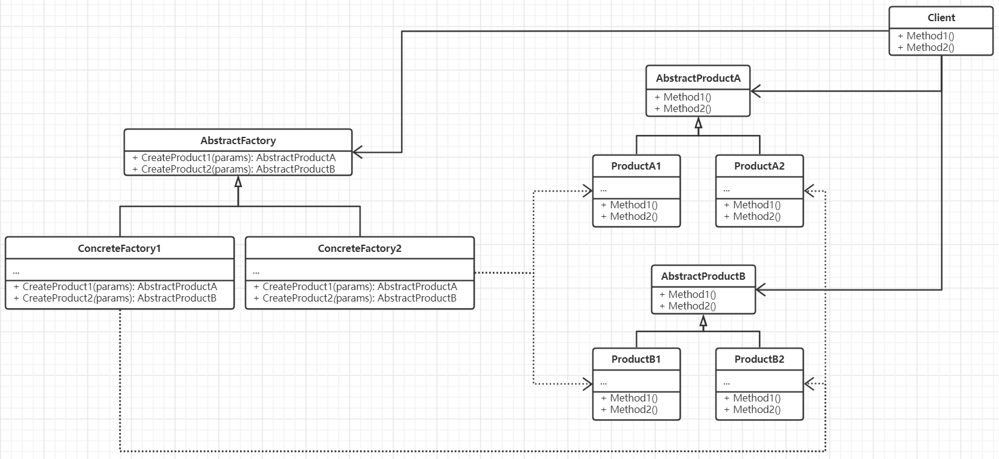

# 抽象工厂

抽象工厂是对简单工厂的进一步扩展，同时也是对系统中对象创建过程的进一步抽象
和封装，**也即抽象工厂将对对象的创建过程延迟到它的子类当中**。属于对象创建模式。

## 思想

将创建者和被创建者全部封装起来，使用接口来表示他们之间的依赖和关联关系，在
表明这种关系时并不指明他们各自的类实现。

## 要素

1. 将创建行为抽象为一个接口，即作为抽象工厂本身，该接口中定义了创建对象的方法
签名。一个抽象工厂内可以定义多个创建方法，即该工厂会生产多种实例对象。
2. 所有的产品都会有一个抽象类型接口，该接口将作为所有操作的参数和返回值，以此
来建立关联。
3. 每一种用途或特性不同的产品都会对应有具体的类实现，同样在生产过程中也会对应有
不同的具体工厂实现。
4. 每一个具体工厂都负责具有独特用途或特性的产品的生产。
5. 调用者仅能可见抽象工厂类型和抽象产品类型。

## 场景

- 一个系统要独立于它的产品创建、组合和表示。
- 一个系统要有多个产品系列中的一个来配置。
- 强调一系列相关的产品的产品对象的设计以便于进行联合使用。
- 提供一个产品类库，只想显式它们的接口而不是实现时。

