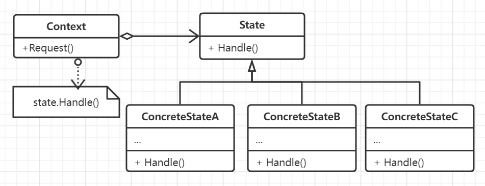

# 状态模式

允许一个对象在其内部状态发生改变时改变它的行为，对象看起来就好像修改了它的类。状态模式是FSM的基础，也是实现自动化的主要工具之一。

一般状态可以被共享，也可以使用单例实现。

## 思想

一个对象整个声明周期内的行为或者某个操作可以很明显地划分为多个阶段，并且这些阶段之间有机会互相转换，那么可以将这些阶段抽象为
状态，每个状态都代表了各个阶段的不同行为，外部环境将请求委托给当前的阶段进行处理。状态内部或者外部环境都可以决定状态转换的路径
或前驱后继关系以及转换条件。

状态模式将与特定状态相关的行为局部化，并且将不同状态的行为分割开，所有与状态相关的代码都存在于某一个具体的状态子类中。状态模式最大的好处
是将转移条件有整块庞大的不清晰的条件或者switch语句分布到各个对象当中，封装状态和转移条件使得意图更清晰，而且使得状态转换更明显和显式化。

## 要素

1. 拥有状态抽象的外部环境，可以认为是状态的宿主。
2. 对状态的抽象接口。
3. 多个具体的实现了抽象接口的状态类。
4. 状态转换的定义者。状态模式并不会显式指定状态转换规则的制定者，如果固定，那么可以在环境对象中定义，一般让状态指定自身的后继
会更加灵活。但这种方法的坏处时一个子类知道至少一个子类的信息。
5. 可以利用表映射的形式完成输入和状态之间的动态绑定。但这种方式强调转换方法，状态机制则是对状态本身进行建模。
6. 状态对象的创建和销毁。一般情况下，对于那些状态转换不是很频繁的情况使用状态指定后继并销毁自身的情况会比较好，对于那些转换频繁的
使用预先定义的表机制会比较好并最终一起销毁比较好。

## 动机

- 一个对象的行为取决于它的状态，并且它必须在运行时刻根据状态改变它自身的行为。
- 一个操作中可能会有庞大的多分支的条件语句，并且这些条件语句依赖与该对象的状态，通常，有多个操作包含这同一结构，状态模式将每一个条件分支
放入到一个具体独立的类中，使得可以根据对象自身的情况将状态作为一个对象，具有独立变化的能力。

