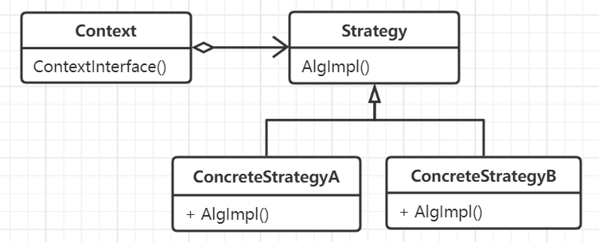

# 策略模式

对于某一个需求或功能定义一系列算法，把它们全部封装起来，并且使它们可以相互替换，这样可以使得算法可以独立于它们的用户而变化。

策略模式和状态模式几乎很相似，但是二者的出发点不同，以及抽象和隐藏的侧重点也不同。

## 思想

将需求与实现分离。不同上下文环境下同一个需求任务可能会有多个不同的实现对象，并且这些对象可以同台替换，达到可重用可扩展的目的，比继承具有
更好的动态灵活性。策略模式提供给了用条件语句选择所需的行为的另一种实现，将行为封装在这些独立的策略类中以消除条件语句。

策略模式在做到解耦和灵活扩展的同时也带来了破环封装性的特点，即用户或者上下文变量必须要知道每一个具体的策略模式以供选择，因此只有当这种行为必须
要客户参与时策略模式才是最好的实现方式。同时也要考虑到对象数量变多和对象之间通信的开销。

## 要素

1. 策略接口，定义所有支持的算法的公共接口，外部调用者使用这个接口来调用某个具体策略类定义的算法。
2. 具体策略，针对不同需求下的算法实现。
3. 环境上下文，算法执行的外部环境，一般即是算法或者策略的调用方。上下文中需要使用一个具体策略对象来配置，维护一个对策略对象的引用。
可以定义一个接口让策略类来访问它的数据。
4. 策略和上下文相互作用以实现选定的算法，当算法被调用时，上下文可以将该算法所需要的所有数据都传递给该策略，或者上下文可以将自身作为参数传递给
策略操作，以便在必要的时候从上下文中获取数据。
5. 上下文一般起到中间数据转发的作用，客户可以和上下文对象交互数据，然后上下文对象将数据传递给内部的策略对象。
6. 策略和上下文之间必须定义好获取数据的接口，可以使用推拉的模式，但数据接口设计的越精细化，耦合程度越深。另外，策略模式本身可以被简化，即
上下文中可以包含缺省实现，但用户没有特殊指定的时候就做到了隐藏。

## 场景

- 许多相关的类仅仅是行为有异，它们所处理的对象以及所产生的结果是一致的。因此可以将不同的处理算法封装为策略，提供了一种
利用多个行为类中的一个来配置一个类的方法。
- 需要使用一个算法的不同变体，比如定义一些反应不同的时间和空间权衡的算法。当这些变体实现为一个算法的类层次时可以使用策略模式。
- 算法可以使用客户不应该知道的数据，可使用策略模式已避免暴露复杂的、与算法相关的数据结构。
- 一个类定义了多种行为，并且这些行为在这个类的操作中已多个条件语句的形式存在，将相关的条件分支移入到它们各自的策略类中以代替这些
条件语句。上下文和策略接口设计的契合程度将直接影响策略模式多大程度上能够达到目的。
