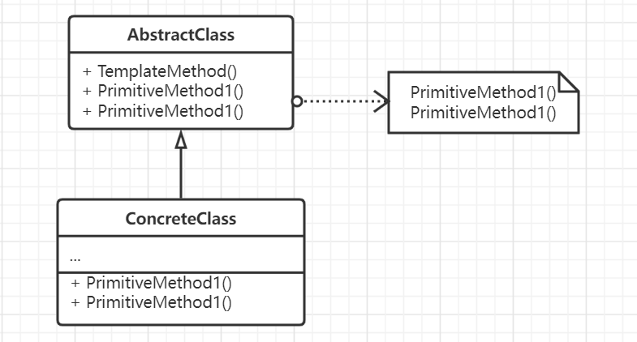

# 模板方法模式

首先定义了一个类中的操作骨架，而将一些具体操作延迟到子类当中，模板方法模式可以使得子类可以不改变
一个算法的结构即可重定义该算法中的某些特定步骤。

模板方法和工厂方法搭配使用，经常调用工厂方法来产生必要的中间数据。
模板方法使用继承来改变算法的一部分，但策略模式使用委托来完成。另外模板方法，建造者有着比较类似的结构。

## 思想

模板方法是一种代码复用的基本技术，在类库中尤其重要，因为模板是对公共行为的抽象，而这个公共行为是
完成某个算法流程可以认为是固定不变的操作，这对于引擎、框架以及类库而言非常重要。

模板方法是导致反向的控制接口，控制反转。它使得父类在必要的时候再调用子类中的具体实现。实际上模板方法
一般会调用下面这些类型的操作:
1. 具体的操作。即具体类或者对客户的操作。
2. 具体的抽象类的操作，通常对子类有用的操作。
3. 原语操作，即那些抽象操作。
4. 工厂方法。
5. 钩子操作，它提供了一个缺省的行为，子类可以在必要的时候进行扩展，一个钩子操作在缺省时是一个空操作。钩子
方法和抽象方法的区别在于钩子方法是可以缺省定义的，而子类可以选择重新定义，但是抽象方法子类必须重新定义。

由于Go自身不支持继承，那么在以类为基础实现模板方法模式就相对比较困难, Go中的方法不能重写，只能有一个所谓的深浅。

## 要素

1. 一个定义了操作流程的模板方法的抽象类。抽象定义在算法处理时的各个原语操作，并在模板方法中调用它们。
2. 具体类，实现了抽象类中各个原语方法已完成特定步骤。实际上抽象类便是通过具体类来完成任务。
3. 具体类通过抽象类中定义的操作流程完成特定子类的相关步骤。
4. 实现时需要注意好封装，例如使用C++时需要利用保护机制，以及控制原语方法的数量。

## 场景

- 首先一次性实现一个算法的不变部分，并将可变的部分留给子类来实现。
- 各个子类中行为被抽取出来放到父类中以避免重复，即首先识别现有代码中的不同之处，并将不同之处分离为新的操作，
最后用一个调用这些新的操作的模板方法来替换这些不同的代码。
- 控制子类扩展，模板方法旨在特定点调用Hook操作，这样就只允许在这些点进行扩展。
