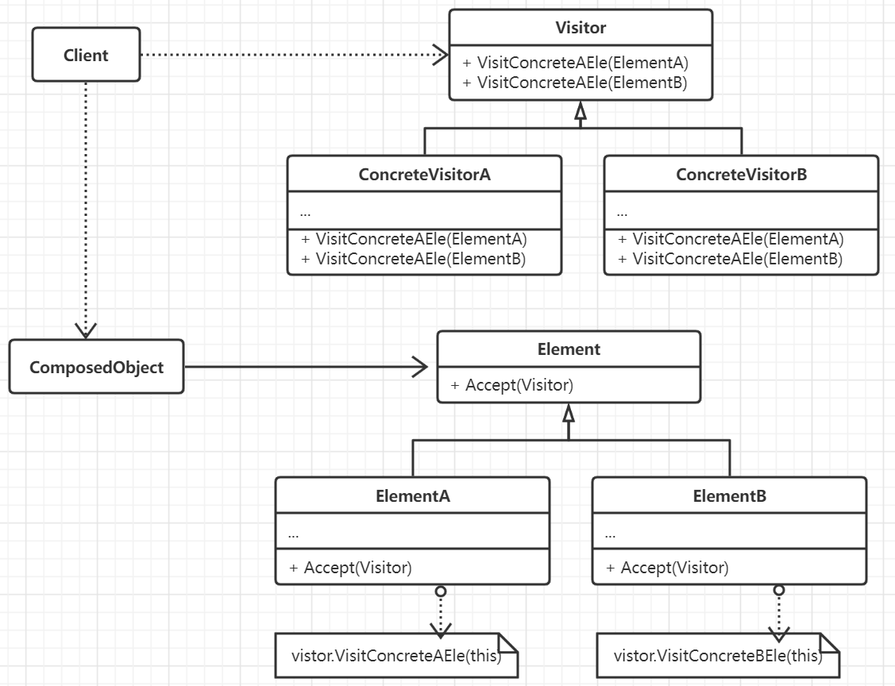

# 访问者模式

一个对象有很多数据组成部分，或者结构相对复杂。现在需要在不改变各元素类的前提下定义作用于这些元素的新操作，
同时做到不破环原有的元素，并且对不同的元素可以有不同的处理。

每一个对象结构都会有一个相关的访问者类，这个抽象的访问者类为定义对象结构的每一个具体元素类都会声明访问具体元素的
方法，同时每一个访问方法都会接收一个具体类型的元素，以允许该访问者直接访问具体元素的接口。当需要新的访问
功能时，具体的访问者会定义新的访问操作方法。

访问者模式中比较多地使用到了双分派(double-dispatch)技术。即一个操作是否能够执行需要两个类型共同决定。

## 思想

访问者模式将一个类中的数据以及与其对应的访问操作相互分离，以避免关键数据对象被访问操作代码污染，以及对象与
访问的耦合绑定。一般将类中的相关访问操作包装在一个独立的对象即访问者当中，并在遍历对象中每一个数据元素时
将此对象传递给当前访问的元素。如果这个元素接受了该访问者，那么就可以向该访问者发送包含自身信息的请求，由访问者
进一步作出操作。

访问者模式的核心时需要定义两个类层次。一个是对于接受操作的类层次，一个是对应于定义对元素的操作的访问者层次，给访问者
类层次增加新的子类便增加新的功能。

首先，访问者模式使得比较容易增加新的操作，原始数据内容不变，而操作对象及其方法可以有多种。访问者还可以通过集中相关的
操作分离无关的操作。相关行文集中在访问者当中，而无关行为则分别放在各自的类定义中。在为每一个具体类提供观察访问方法的
情况下增加新的元素子类比较困难，因为这意味这要修改所有的访问者接口，在频繁有新的元素类加入的情况下将访问操作
定义到类本身或许会好一些。

访问者模式还可以有累计状态，但是对具体对象进行访问时可能会破坏元素本身的封装性，需要元素本身提供足够多的公开方法。

## 要素

1. 访问者接口。首先需要在接口中为每一个需要访问的具体类定义一个访问方法Visit, 利用这个指向性非常明确的方法来区分具体
对象以及知道它们的类信息(显然这样是在面向实现编程)，此时访问者便可以通过这个对象特定接口来访问其数据。
2. 具体的访问者。实现接口中的方法声明，内部可以定义和访问操作相关的状态。
3. 元素接口，定义一个Accept接口，它以一个访问者为参数，然后在内部调用这个访问者对应的访问方法。
4. 具体元素，实现接口方法。
5. 对象结构，比如一个复合接口或者是一个迭代器对象，只要能够枚举它内部的元素或者是能够让访问者访问它的元素即可。
6. 访问者模式必须要先创建一个具体的访问者，然后遍历和访问目标对象中各个元素结点。

## 场景

- 一个对象包含有很多类对象，它们都有着不同的接口，但希望能够对这个对象实施一些依赖于其具体类的操作。
- 需要对一个对象结构中的组成对象进行很多种不同的并且不想关的操作，并且想避免让这些操作污染这些对象的类，此时便需要
访问者封装相关的操作，并且让每个应用仅仅包含所用到的操作。
- 目标对象的类很少改变，但是需要经常在这个类对象上增加很多新的操作。
