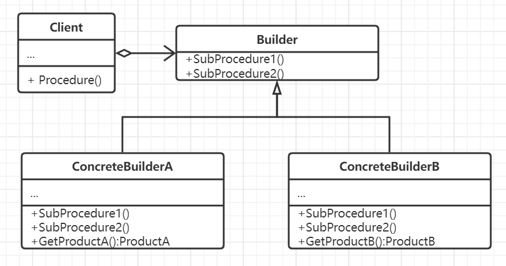

# 建造者模式

将功能以及作用相似的一族对象的构建过程或某个功能算法过程抽象出来，划分若干个明显的步骤，
每种对象对应的类按照规定的步骤实现以达到不同的表示。

Builder与抽象工厂模式的区别在于，虽然二者都是创建复杂对象，但是Builder模式着重于一步步构造一个复杂对象，
而抽象工厂着重于多个系列的产品，一个强调过程，一个强调结果。而且前者在所有步骤执行完毕之后返回结果，而后者
立即创建完成，抽象层级更高。

实际上Builder也可以和抽象工厂搭配使用，二者并不矛盾。

## 思想

将一个处理流程中的多个关键实现部分与流程组织本身相分离，使得同一个算法可以有多种不同的
实现演绎，并且可以很方便进行扩展。

##要素

1. 创建者，即指定处理流程中各个关键处理操作的接口。
2. 具体的创建者，代表了创建者的具体实现，以完成不同表示的装配或处理实现，并提供返回处理结果的方法。
3. 存在一个具体使用创建者的对象。
4. 一组处理完毕后需要返回的结果类实现，没有必要将这些类用接口封装。

## 场景

- 创建复杂对象的算法应该独立于该对象的组成部分以及它们的装配方式。
- 构建过程必须允许被构造的对象有不同的表示。
- 构造代码与表示代码相分离。
- 对构建过程进行更精确地控制。
- 定义的创建者接口对象针对应用内的问题必须要足够普遍，否则不便于支撑扩展实现实例。

