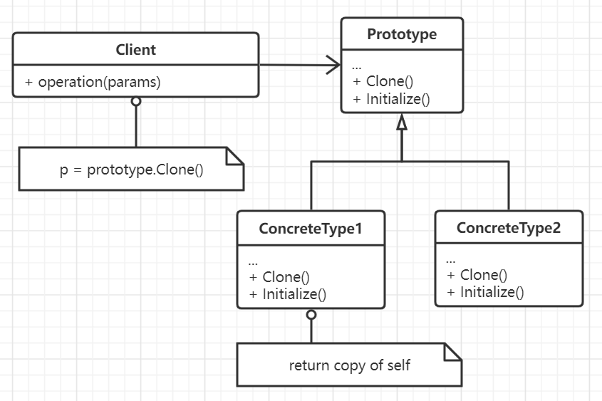

# 原型模式

用原型实例指定需要创建对象的种类，并以此来创建众多新的对象，在一系列类似但不完全相同的对象之间实现依据实例
来完成对目标种类对象的创建工作。值得注意的是，这一系列对象之间有着最起码的相似性，或者至少有着一部分代码或
功能是一样的，然后各自会实现Clone接口。

和抽象工厂类似但彼此之间对对象的创建是互相冲突的。抽象工厂以一种静态的方式完成对对象创建过程的抽象，而对于
原型模式来说则是动态的。原型模式的核心贡献在于提供了在运行时动态载入新类的机制。

## 思想

有多个类似但种类不同的对象，例如游戏世界中的怪物，乐谱中的音符等，它们各自之间有着必要但细微的差别，且种类繁多。
如果为每一种对象都提供对应的类实现那么显然会造成子类过多。因此可以根据当前对象的数据创建一个其它类型的对象，并
能够修改内部的数值，即实现Clone和Initialize接口方法，本质上可以看作是对象内部的属性的不同取值结果会有不同的
行为表示。

克隆时需要注意的是深浅拷贝问题，在C++中提供了拷贝构造函数，但在Go中是没有这种类似机制的。

## 要素

1. 原型接口声明，包含了Clone()以及Initialize()。
2. 实现了原型接口的具体类。
3. 调用方。
4. 一般情况下需要保留一个原型注册表以供应用在合适的时机检索并克隆。
5. 实现正确的克隆操作，考虑深浅拷贝问题。

## 场景

当一个系统中需要大量产生功能非常相似的不同种类对象时，比如在游戏场景中，以及要注意需要实例化的类是在
运行时指定，例如动态装载。或者为了避免创建一个与产品平行的工厂类，或者一个类的实例只有几个不同状态的
组合中的一种时，建立相应数目的原型并克隆比每次都使用合适的状态去显式实例化他们要方便。

原型模式首先需要系统提供一个原型并注册，然后为克隆后的对象指定新的值来表示新的行为。

