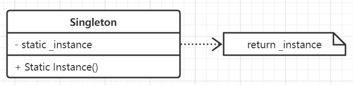

# 单例模式

单例模式是最简单最基础的模式之一，主要用来为系统提供唯一的全局对象，是对系统中那些唯一功能或服务提供者的抽象。

## 思想

保证某些类有且仅有一个实例，且提供一种全局访问的方法，使得在任何时候返回的都是该唯一对象。例如工厂模式
常使用单例来获取全局唯一变量。

## 要素

1. 需要进行单例化的类。静态方法，或者全局变量。C++通过类的Instance操作完成对象访问。
2. 严格控制客户访问行为。
3. 在C++中，如果要实现提供单例的子类，那么构造函数应该是保护的。
4. 将单例定义为全局变量或者静态对象的时候只依赖其自身的自动初始化是不够的，首先不能保证静态对象
或者全局对象只有一个实例被声明。或者单例需要程序执行后的结果才能初始化，无论这个单例是否被使用，
它都要被创建。
5. 在OOP中如果单例类有多个子类，并且需要根据时机情况来获取不同的单例时，可以将各自的单例的实现
放在子类里，而在父类中通过Instance方法传参来确定获取哪一个单例，但这种方法并没有使用注册的方式
灵活。
6. 在Go中需要借助接口、包全局变量以及init方法和once来保证安全性。

## 场景

- 当类只能有一个实例(或者进一步扩展为几个实例)并且客户可以从一个众所周知的访问点进行访问。
- 这个实例应该是通过子类化可扩展的，并且客户应该无需更改代码就能扩展的实例。

