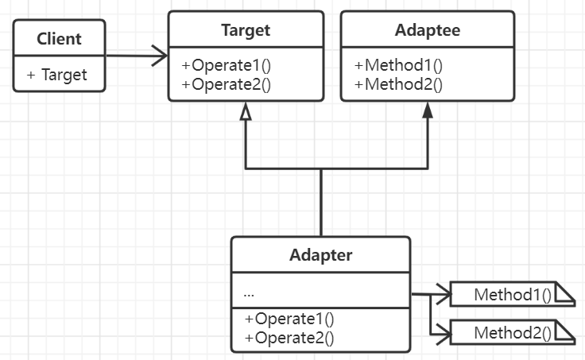
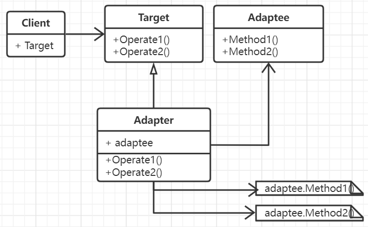

# 适配器模式

两个无法产生复用关系的类，或者有两套不同的接口，为了使得其中一个能够复用另外一个已经存在的功能，使其融合不兼容的接口或类之后能够处于
目标所在的接口体系中，便采用适配器模式来对不同的接口进行适配从而达到一起工作。

实际上适配器模式是编程过程中潜移默化使用最多的模式。

## 思想

不同的类或者接口实现往往不能兼容，但是想在一个复用体系下复用另一套体系中的功能，那就需要通过类或者对象两种方式其中任意一种将其中一个的
功能纳入到另一个中，即完成适配。

适配可以分为类适配和对象适配。类适配是一种以静态的方式，通过子类继承获取功能，并通过接口实现提供服务以达到协作工作的目的。类适配器的好处是
通过继承可以自定义索要适配的行为，即能够了解父类实现。但是会增加类层级，**而且类适配器不能适配一个类的所有子类**。对象适配即通过调用对象方法以达到功能
复用，而且可以适配所有子类，但由于以对象组合的方式达成复用，因此在对适配的功能进行重定义时比较困难。

## 要素

1. 定义客户需要使用的目标接口。
2. 一个已经存在的且需要适配的接口。
3. 对目标以及已经存在的接口进行适配的子类实现。
4. 考虑到对所有子类进行适配，则可以使用对象适配器。
5. 考虑到适配的程度，因适配而要进行的工作量。
6. 考虑双向适配。
7. C++中适配实现时，应该使用公有方法继承目标类，而使用私有方法继承适配类。
8. 适配的内容尽量抽象。

## 场景

- 想使用一个已经存在的类，而它的接口不符合规范。
- 创建一个可复用的类，这个类需要和其它不相干的或者不可遇见的类进行协同工作。
- 复用一些已经存在的子类，但不能对每一个都进行子类化以匹配它们的接口，则可以利用对象适配器来适配。

