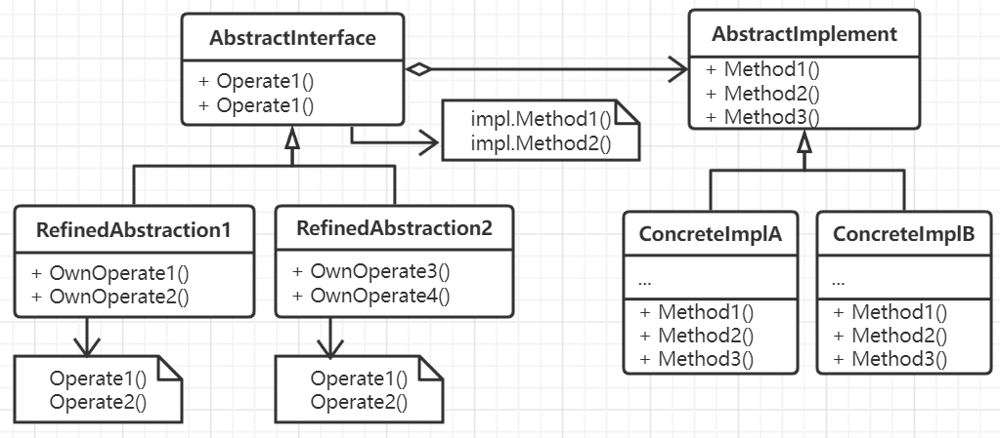

# 桥接模式

继承是OOP的核心特性，但是继承也导致了将抽象和对应的实现全混合在一起，**使得难以对抽象部分和
实现部分独立进行修改、扩充和重用。** 很容易造成子类爆炸问题。

如果将系统的抽象与对应的实现相分离，以对象组合的方式来完成复用，将从更抽象的角度为系统带来
可复用性和可扩展性，整个系统将会变得扁平，此时客户对服务的调用并不受特定平台的限制，代码复用
也会变得容易。

和桥接模式相关的模式有抽象工厂模式以及适配器模式，抽象工厂可以用来创建一个特定的桥接模式，
而适配器帮助无关的类进行协助工作，一般在系统设计完成之后使用，但桥接模式从系统搭建时便开始
使用。

## 思想

将抽象部分与实现部分相互分离，使其可以独立地变化。考虑到一个产品或者一个服务接口，因为平台
或者任何其它原因都需要多套子实现，如果采用继承的方式，子类在实现接口的同时也会与抽象深度绑定
从而导致上层客户代码如果想要改变或者迁移到其它平台就会很难。但是如果将服务的接口抽象部分整合
为一个类层次结构，将每个抽象部分的实现剥离出去整合为另外一个类层次结构，二者通过组合的形式
进行联系，那么客户的代码就只会调用抽象方法，而不会涉及到具体实现和平台的限制，整个功能替换或平台迁移就会变得简单。

桥接模式的难点在于对客户所调用的接口代码进行适当的抽象和封装，同时对所有实现部分以合适的粒度
进行抽象和封装。

## 要素

1. 面向客户的抽象接口。抽象类中还要维护一个指向具体实现类的对象的指针。
2. 定义针对不同情况时的细化的抽象类，或者是对接口的扩充。实际上就是对具体场景的封装。
3. 面向开发实现的实现接口，定义了具备合适粒度的对外服务方法。
4. 实现这些较细粒度方法的具体实现类。
5. 面向客户的类结构是从功能的角度出发，忽略低层实现细节，而面向实现的那一套类结构则从不同
场景下的实现出发，提供了充分的针对当前条件下的具体实现。

## 场景

- 不希望抽象和它的实现之间有绑定关系，为跨平台或者在运行时刻对应的实现部分能够被选择或者被切换。
- 类的抽象以及它的实现都可以通过生成子类的方法进行扩充，使得可以对不同的接口以及实现部分进行组合，
并分别进行扩充。
- 对抽象类或接口的实现对用户时透明的，不影响用户的调用和使用。或者是达到对用户隐藏实现细节的目的。
- 多个对象之间共享实现部分。

