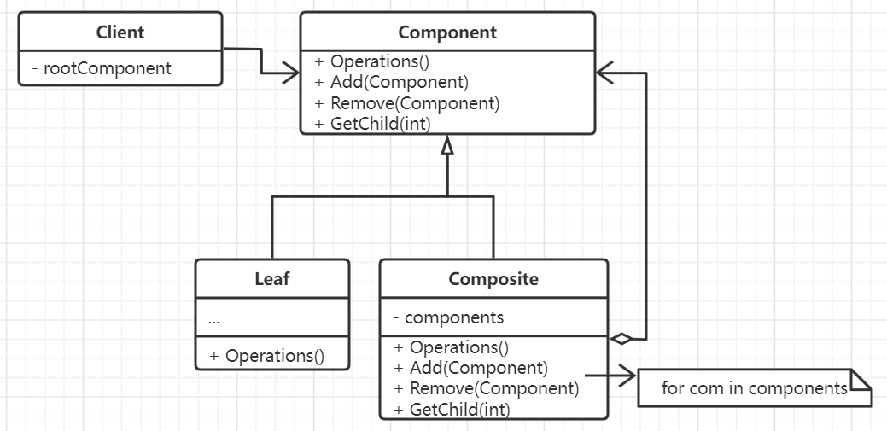

# 组合模式

有些应用需要以树状的层级结构去组织各个子部分，并且能够以递归的形式来构成比较大的规模。
例如在GUI类型的程序中,经常需要将子组件迭代组合成更庞大的结构，使得整体和部分在使用
上具有较好的一致性。

组合模式非常适合那种天生就具备树形组织的应用，并且常常和责任链模式和装饰器模式搭配使用。
同时，迭代器可以用来遍历组合对象，观察者模式将分布在叶子节点和容器节点种的行为局部化。

## 思想

定义中包含了最基本的对象和组合对象的类层次结构，以递归的形式构建复杂系统，使得设计更
一般化。

实际上，可以将组合模式看作是一个多叉树，每个节点都实现了组合接口，并且拥有统一的公开
方法，同样可以以树的遍历方式去遍历组合对象，然而各个节点上的操作可能对整个多叉树的结构
有影响，因此显式地引用父节点能够在管理组合对象时较为方便。

**安全性和透明性的权衡**。考虑到叶子节点和容器节点实际上行为表示是不同的，如果将所有的节点
抽象为一个类型，那么对上就会隐藏这种差异，在对叶子节点调用容器节点时就有可能会产生意外的行为。
但如果容器对象自身提供一些方法，这样又会导致各自实现不同的接口，或者类型转换。但事实上透明性总会更重要
一点。

## 要素

1. 一个对所有组件进行抽象的接口，定义了所有对象之间的行为。
2. 具体容器对象的实现。
3. 具体叶子对象的实现。
4. 一个高层的调用者客户。
5. 显然每一个组合节点都有可能贮藏多个对象，那么就需要考虑提供一种比较快的机制或者
缓存实现以提升访问的效率。

## 场景

- 需要有一种机制能够很好处理整体和部分之间的组合关系。
- 希望客户在调用时能够忽略组合对象与单个对象之间的不同，统一使用系统中的所有对象。

