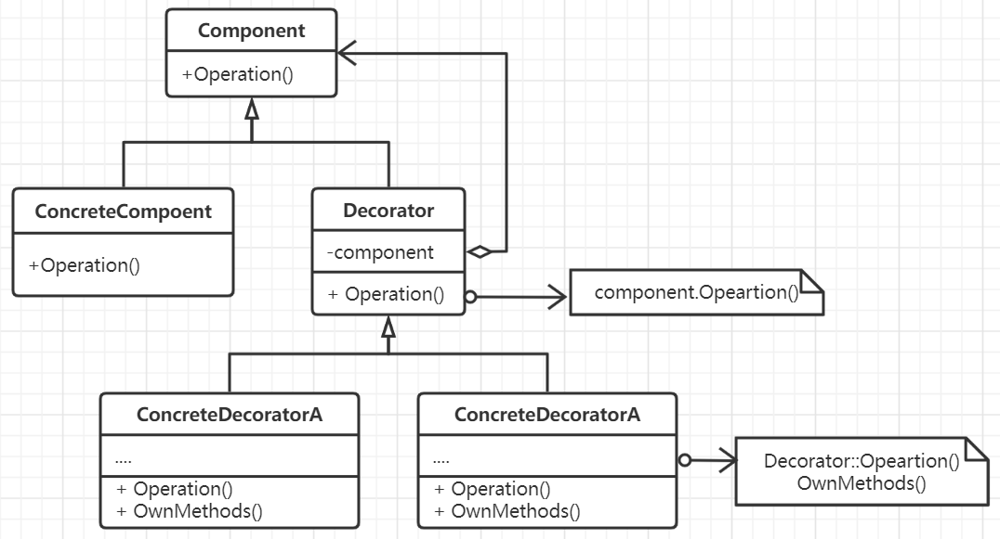

# 装饰器模式

如果想要给一些对象灵活地添加一些职责或功能，那么可以考虑采用装饰器模式来为已存在的对象(而不是类)添加一些新功能。
而且这种额外的功能还可以不断地嵌套以丰富组件。

## 思想

为了避免继承带来静态绑定，并且进一步隐藏信息，为用户提供透明的服务，则可以将系统中所有对象按照功能拆分为基本
功能对象和附加功能对象，二者实现同一个接口，以内嵌的方式完成对基本组件的装饰，具体使用时则调用的是装饰后的对象。
由于二者采用的是同一套接口，因此可以很灵活地选择添加使用装饰对象或者不适用装饰对象，与静态继承相比，具有很强的灵活性。

装饰模式和适配器模式相比，装饰模式仅仅为目标对象增加额外功能而不改变接口，而适配器模式则要改变和适配目标对象的接口，
达到复用另外一个类或对象的功能。
装饰模式也可以看作是组合模式的退化，但是组合模式强调对象的组合以形成复杂树状结构，而装饰模式则是为了为目标对象透明地
增加功能。
装饰模式可以看作是在改变对象的外表，而策略模式则是在改变对象的内核。

## 要素

1. 定义一个抽象组件接口，用来抽象代表这些对象，并给它们动态添加职责。
2. 一个具体服务实现类，用来表示最低层的那个组件，是被装饰的对象，也是装饰对象最内部的包裹对象。
3. 装饰器，维持着对组件对象的引用指针，并定义与组件一样的接口。可以用一个具体的类来表示并提供缺省的
方法传递调用实现。
4. 具体的装饰对象。
5. 提供一种即用交付的风格来进行，同时也会产生很多小对象，并且这个系统是相对负责且比较难学的，比较难排错。
6. 多种外壳，一个内核，而策略模式则是一个外壳，多种内核。

## 场景

- 在一种场景下，需要以动态、透明的方式给单个对象添加职责。
- 需要能够处理那些可以撤销的职责。
- 当不能采用生成子类的方法进行扩充时，可能有大量独立的扩展，为支持每一种组合产生大量的子类，使得子类能够爆炸式增成长。
或者类定义被隐藏，或类定义不能生成子类。
